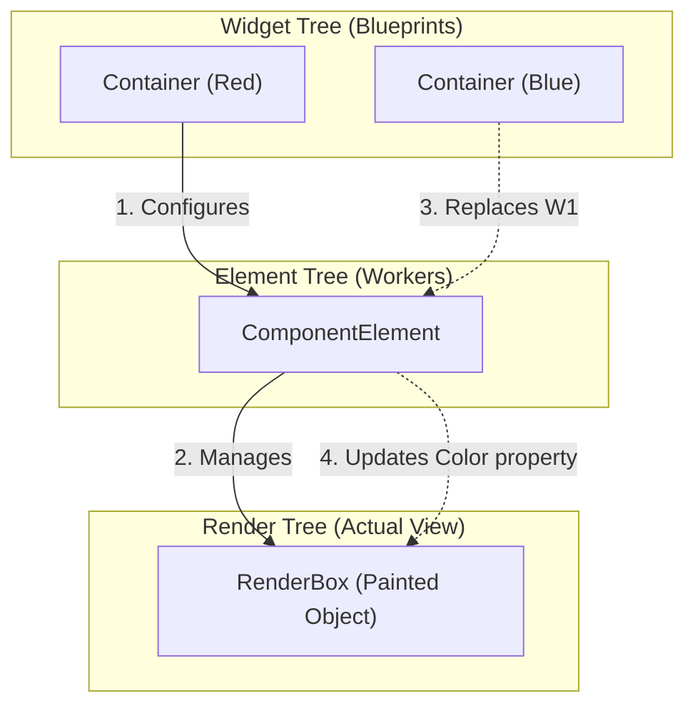

# Flutter Under the Hood: The Three Trees

This document explains **how Flutter actually works**. Understanding the interaction between the **Widget**, **Element**, and **RenderObject** trees is the key to mastering Flutter performance.

---

## 1. The Big Picture

Flutter uses three parallel trees to render your UI.

| Tree | Responsibilty | Class | Mutable? | Analogy |
| :--- | :--- | :--- | :--- | :--- |
| **Widget Tree** | **Configuration**. Describes "what" the UI should look like. | `Widget` | ❌ Immutable | Blueprints 📝 |
| **Element Tree** | **Lifecycle & Structure**. The "glue" that holds everything together. | `Element` | ✅ Mutable | Workers 👷 |
| **Render Tree** | **Layout & Painting**. The heavy lifting engines that draw pixels. | `RenderObject` | ✅ Mutable | Actual Building 🏢 |

---

## 2. In Detail

### 📝 The Widget Tree (Configuration)

* **What it is**: Lightweight, immutable blueprints.
* **Cost**: Extremely cheap to create and throw away.
* **Example**: `Container(color: Colors.red)`
* **Behavior**: When you call `setState`, you are essentially throwing away the old Widget tree and creating a brand new one.

### 👷 The Element Tree (Structure)

* **What it is**: The persistent backbone of your app. An `Element` is created *once* for a Widget and stays in memory.
* **Responsibility**:
  * Holds the `BuildContext`.
  * Holds the **State** (for StatefulWidgets).
  * Manages the parent/child relationship.
  * Updates the RenderObject when the Widget changes.
* **Behavior**: It compares the *new* Widget with the *old* Widget. If they match (same type & key), it **updates** itself. If they don't, it unmounts and rebuilds.

### 🏢 The Render Tree (Layout & Painting)

* **What it is**: The expensive objects that actually calculate geometry (Layout) and draw pixels (Paint).
* **Cost**: Expensive to create and expensive to layout. We want to keep these alive as long as possible.
* **Example**: `RenderPadding`, `RenderFlex` (Column/Row), `RenderParagraph` (Text).

---

## 3. The "Diffing" Algorithm (Reconciliation)

When you call `setState()`, Flutter doesn't destroy the whole app. It runs a reconciliation process.

**The Question**: "Can I reuse the existing Element and RenderObject?"

**The Rule**: `canUpdate(oldWidget, newWidget)`
> Returns `true` if: `oldWidget.runtimeType == newWidget.runtimeType` && `oldWidget.key == newWidget.key`

### Scenario A: Update (Efficient) 🟢

1. **Old**: `Text("Hello")`
2. **New**: `Text("World")`
3. **Check**: Type is same (`Text`), Key is same (null).
4. **Result**: Element stays. RenderObject (`RenderParagraph`) is **updated** with new text string. **No** new objects created in RenderTree.

### Scenario B: Swap (Expensive) 🔴

1. **Old**: `Text("Hello")`
2. **New**: `Image(...)`
3. **Check**: Type is different (`Text` vs `Image`).
4. **Result**:
    * Element destroys the `RenderParagraph`.
    * Element unmounts itself.
    * New Element created for Image.
    * New `RenderImage` created.

---

## 4. Visualizing the Process



1. **Initial Render**: `Container(Red)` creates an Element, which creates a RenderBox.
2. **Rebuild**: You change color to `Blue`. A new `Container(Blue)` widget is created.
3. **Diffing**: Element checks: "Is it still a Container? Yes."
4. **Update**: Element takes the `Blue` color from the new widget and simply **updates a property** on the existing RenderBox.
5. **Result**: The expensive RenderBox is **reused**.

---

## 5. Why `const` matters?

If you use `const Widget()`, you are telling Flutter:
*"This specific instance of configuration will NEVER change."*

When the Element sees a `const` widget coming in that is **identical** (same instance reference) to the previous one, it short-circuits the entire diffing process. It doesn't even bother checking the properties. It just stops.

This prevents the "Update" phase from propagating down the tree, saving CPU cycles.

---

## 6. How "Helper Methods" break this

When you use a Helper Method:

```dart
_buildItem() { return Container(); }
```

1. Parent rebuilds.
2. `_buildItem()` is called.
3. A **NEW** `Container` widget is returned every time.
4. The Element *must* compare the new Container vs the old Container.
5. It repeats this for every item in your list.

When you use a `const CustomWidget()`:

1. Parent rebuilds.
2. Flutter sees `const CustomWidget()`.
3. It compares references. They are the same.
4. **It stops immediately.** No build method called. No diffing of children.

---

## 7. Key Takeaways

1. **Widgets are cheap.** Don't worry about creating them.
2. **RenderObjects are expensive.** We want to keep them alive.
3. **Elements manage the relationship.** They decide when to update vs destroyed.
4. **Keys control identity.** If you want to force a rebuild (or preserve state across moves), use Keys.
5. **Const is King.** It stops the tree walk early.
