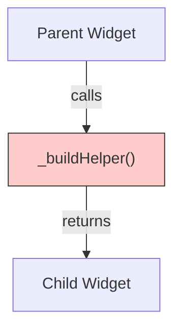
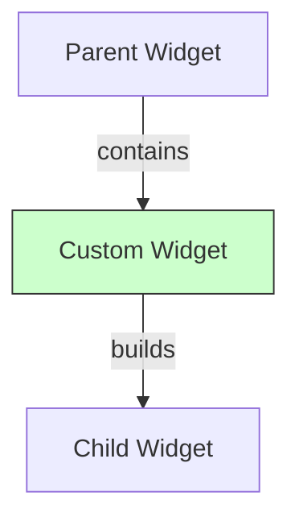

# Flutter Widget Study: Helper Methods vs Custom Widgets & Under the Hood

This project serves as a reference to demonstrate the differences between using **Helper Methods** and **Custom Widgets** for building UI components in Flutter. It also includes an **Under the Hood** demo to visualize the interaction between the Widget, Element, and RenderObject trees.

## 1. Helper Methods vs Custom Widgets

When splitting up large build methods, developers often choose between extracting UI into a private method or a separate Widget class.

### 🔴 Helper Methods (`_buildItem()`)

- **What**: A function returning a Widget.
- **Behavior**: It is just code executution within the parent's `build` method.
- **Performance**:
  - ⚠️ **Rebuilds every time the parent rebuilds.**
  - No separate Element or separate context.
  - Cannot be `const`.
  - Harder to test in isolation.

### 🟢 Custom Widgets (`class MyItem extends StatelessWidget`)

- **What**: A dedicated class extending `StatelessWidget` or `StatefulWidget`.
- **Behavior**: Creates a new Element in the Element Tree.
- **Performance**:
  - ✅ **Can be skipped during rebuilds** if the constructor is `const` or parameters haven't changed.
  - Has its own `BuildContext`.
  - Better for "separation of concerns" and testing.

---

## 2. Visualizing the Difference

### Helper Method Structure

When `ParentWidget` rebuilds, `_buildHelper()` IS CALLED again.

### Custom Widget Structure

When `ParentWidget` rebuilds, `CustomWidget` MIGHT NOT rebuild.

---

## 3. Under the Hood: The Three Trees

Flutter renders pixels using three parallel trees. The **Under the Hood** demo logs these lifecycles.

| Tree | Responsibilty | Class | Mutable? |
| :--- | :--- | :--- | :--- |
| **Widget Tree** | **Configuration**. Describes "what" should be drawn. Lightweight blueprints. | `Widget` | ❌ Immutable |
| **Element Tree** | **Lifecycle & State**. Instantiates the widget and manages its place in the tree. | `Element` | ✅ Mutable |
| **Render Tree** | **Painting & Layout**. Handles sizing, hit-testing, and drawing pixels. | `RenderObject` | ✅ Mutable |

### How they interact

1. **Widget**: "I want a blue box of size 100x100."
2. **Element**: "Okay, I'll update the existing RenderObject to match that description."
3. **RenderObject**: "Understood. Re-painting myself blue."

**Key Takeaway**: Rebuilding a Widget is cheap. Rebuilding an Element or Layout/Painting a RenderObject is expensive. We want to avoid the latter when possible.

## 📹 Video Reference

For a deep dive, watch this session: [Flutter Under the Hood](https://www.youtube.com/watch?v=996ZgFRENMs)
