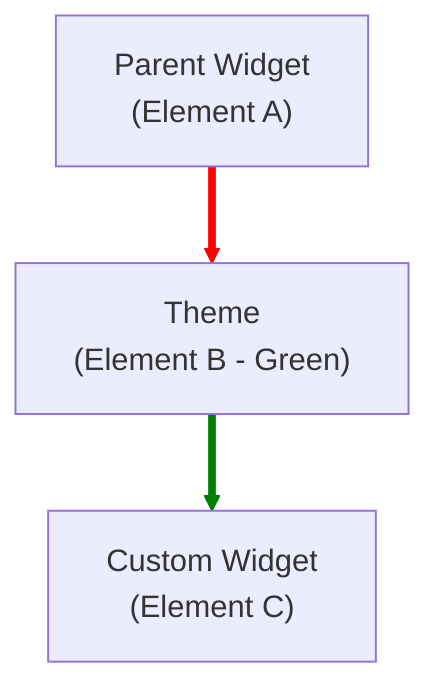

# Flutter Deep Dive: Custom Widgets vs Helper Methods

This document provides a comprehensive comparison between using **Helper Methods** and **Custom Widgets**, with concrete code examples for each scenario.

---

## 1. Executive Summary

| Feature | Helper Method (`_buildThing()`) | Custom Widget (`class Thing extends ...`) |
| :--- | :--- | :--- |
| **Performance** | ⚠️ Low (Rebuilds with parent) | ✅ High (Can be `const`, skips rebuilds) |
| **Context Access** | ⚠️ Parent's Context (The Trap) | ✅ Own Context (Safe) |
| **State Management** | ❌ None (Stateless only) | ✅ Full Lifecycle (`initState`, `dispose`) |
| **Testing** | ❌ Hard to test in isolation | ✅ Easy to test (`pumpWidget`) |

---

## 2. Performance & Rebuilds

### ❌ Helper Method Approach

**Problem**: Even if `title` hasn't changed, `_buildItem` runs every time `ParentWidget` rebuilds (e.g., during an animation or text input).

```dart
class ParentWidget extends StatelessWidget {
  @override
  Widget build(BuildContext context) {
    return Column(
      children: [
        // ⚠️ Runs on EVERY build. No optimization possible.
        _buildItem('Hello'),
        _buildItem('World'),
      ],
    );
  }

  Widget _buildItem(String title) {
    print('Building $title'); // Prints continuously!
    return Text(title);
  }
}
```

### ✅ Custom Widget Approach

**Solution**: Using `const` tells Flutter "This widget calculates the same output given the same inputs."

```dart
class ParentWidget extends StatelessWidget {
  @override
  Widget build(BuildContext context) {
    return Column(
      children: [
        // ✅ Built ONCE. Skipped on subsequent parent rebuilds.
        const MyItem(title: 'Hello'),
        const MyItem(title: 'World'),
      ],
    );
  }
}

class MyItem extends StatelessWidget {
  final String title;
  const MyItem({super.key, required this.title});

  @override
  Widget build(BuildContext context) {
    print('Building $title'); // Prints ONLY ONCE!
    return Text(title);
  }
}
```

---

## 3. Context & Scope (The "Trap")

### ❌ Helper Method Approach

**Problem**: The helper method uses the `context` from the **Parent**. It cannot see widgets (like `Theme` or `Provider`) defined *inside* the parent's build method.

```dart
Widget build(BuildContext context) {
  // 1. We define a Green Theme here
  return Theme(
    data: ThemeData(iconTheme: IconThemeData(color: Colors.green)),
    // 2. We pass the PARENT context to the helper
    child: _buildIcon(context), 
  );
}

Widget _buildIcon(BuildContext context) {
  // ⚠️ FAILURE: This looks up using Parent's context.
  // It searches ABOVE the Theme we just defined.
  // Result: Icon is Black (default), NOT Green.
  return Icon(Icons.star, color: Theme.of(context).iconTheme.color);
}
```

### ✅ Custom Widget Approach

**Solution**: A Custom Widget provides its own `BuildContext`, which is a **child** of the `Theme`.

```dart
Widget build(BuildContext context) {
  return Theme(
    data: ThemeData(iconTheme: IconThemeData(color: Colors.green)),
    // 2. We insert the Custom Widget
    child: const MyIcon(),
  );
}

class MyIcon extends StatelessWidget {
  const MyIcon({super.key});

  @override
  Widget build(BuildContext context) {
    // ✅ SUCCESS: This context is BELOW the Theme.
    // Result: Icon is Green!
    return Icon(Icons.star, color: Theme.of(context).iconTheme.color);
  }
}
```

### The Technical Reason (The "Why")

In Flutter, **`BuildContext` is just a handle to an Element**. When you call `Theme.of(context)`, Flutter starts looking **UP** the Element Tree from that specific context.

1. **Parent Widget** (Element A) <--- *The context you have in `build()`*
2. `↓`
3. **Theme Widget** (Element B) <--- *Defined inside `build()`*
4. `↓`
5. **Helper Method** uses "Element A".
    * It looks up from A. It **cannot see** B because B is its child, not its ancestor.
6. **Custom Widget** creates "Element C".
    * It looks up from C. It **sees** B immediately.

### Visualization



* **Helper Method**: Stand at **A**. Look up. You see the App Root. You *don't* see **B** below you.
* **Custom Widget**: Stand at **C**. Look up. You hit **B** (Green Theme) immediately.

### ✅ The "Builder" Solution

If you don't want to create a new class, you can use a `Builder` widget. It creates a new Element (and thus a new Context) inline.

```dart
Theme(
  data: greenTheme,
  child: Builder(
    builder: (newContext) {
      // ✅ SUCCESS: newContext is a child of Theme
      return _buildHelper(newContext); 
    }
  ),
);
```

---

## 4. Lifecycle & State

### ❌ Helper Method Approach

**Problem**: You cannot hold state (like an animation controller) inside a helper method. You are forced to pollute the Parent's state.

```dart
// ⚠️ Parent becomes massive with unrelated variables
class ParentWidget extends StatefulWidget { ... }

class _ParentState extends State<ParentWidget> {
  // Logic for Item 1
  late AnimationController _controller1;
  // Logic for Item 2
  late AnimationController _controller2;
  // ... and so on
```

### ✅ Custom Widget Approach

**Solution**: Encapsulate logic. Each list item manages its own state.

```dart
class MyAnimatedItem extends StatefulWidget { ... }

class _MyAnimatedItemState extends State<MyAnimatedItem> {
  // ✅ Logic is isolated to this specific item
  late AnimationController _controller;

  @override
  void initState() {
    super.initState();
    _controller = AnimationController(vsync: this);
  }

  @override
  void dispose() {
    _controller.dispose(); // ✅ Self-cleaning
    super.dispose();
  }
}
```

---

## 5. Testing

### ❌ Helper Method Approach

**Problem**: To test `_buildItem`, you must build the **entire** Parent Widget.

```dart
testWidgets('Finds item text', (tester) async {
  // ⚠️ Must load the whole screen just to test one button
  await tester.pumpWidget(MaterialApp(home: ComplexParentScreen()));
  
  // Hope that ComplexParentScreen doesn't require 10 providers...
  expect(find.text('Submit'), findsOneWidget);
});
```

### ✅ Custom Widget Approach

**Solution**: Test the component in complete isolation.

```dart
testWidgets('MyButton displays label', (tester) async {
  // ✅ Fast, lightweight, isolated test
  await tester.pumpWidget(MaterialApp(home: MyButton(label: 'Submit')));
  
  expect(find.text('Submit'), findsOneWidget);
});
```
